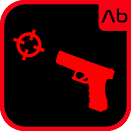

<div align="center">



# NERVE

**Bare-hand control for BONELAB — Quest hand tracking → full finger sync**

Put the controllers down. Your hands drive the rig. Every finger — same curls Quest tracks.

<br/>


&nbsp;

&nbsp;
<a href="https://t.me/be_primex"></a>

<br/><br/>

<a href="https://github.com/XBePrime/BONELAB/releases/tag/nerve-v1.1.0"></a>
&nbsp;
<a href="Nerve.dll"></a>
&nbsp;
<a href="https://t.me/be_primex"></a>

</div>

---

## What it does

| | |
|---|---|
| **Hand tracking** | Meta Quest 3 / 3S — same `XRHand` buffers Quest feeds the game |
| **Per-finger sync** | Thumb · Index · Middle · Ring · Pinky — 1:1 curls, no smoothing |
| **Joints** | Full skeleton overlay when available (26 bones) |
| **Gestures** | Flip-off, fist, OK, point — rig mirrors you |
| **Wrist** | Follows Quest palm while hands are tracked |
| **Grip** | Pinch / fist maps to grab input |
| **Walk** | Point hand + pinch thumb/index → move that way |

---

## Menu

```text
BoneMenu → NERVE
```

| Option | Default |
|--------|---------|
| Enabled | On |
| Sync Wrist | On |
| Sync Bones | On |
| Full Skeleton | On |
| Grip From Fingers | On |
| Pinch Walk | On |

---

## How to use

1. Enable **BoneMenu → NERVE → Enabled**
2. Set controllers down (Quest hand tracking kicks in)
3. Move your fingers — the avatar hands follow
4. **Walk:** aim with your hand, pinch thumb + index — you move that way

Works best on **Meta Quest 3 / 3S** with hand tracking enabled in headset settings.

---

## Install

1. MelonLoader / LemonLoader  
2. [BoneLib](https://thunderstore.io/c/bonelab/p/gnonme/BoneLib/)  
3. `Nerve.dll` → `Mods/`  
4. **BoneMenu → NERVE**

<div align="center">

<br/>

<a href="Nerve.dll"></a>
&nbsp;
<a href="https://thunderstore.io/c/bonelab/p/gnonme/BoneLib/"></a>
&nbsp;
<a href="https://t.me/be_primex"></a>

<br/><br/>

**BE PRIME** · [@be_primex](https://t.me/be_primex)

</div>
